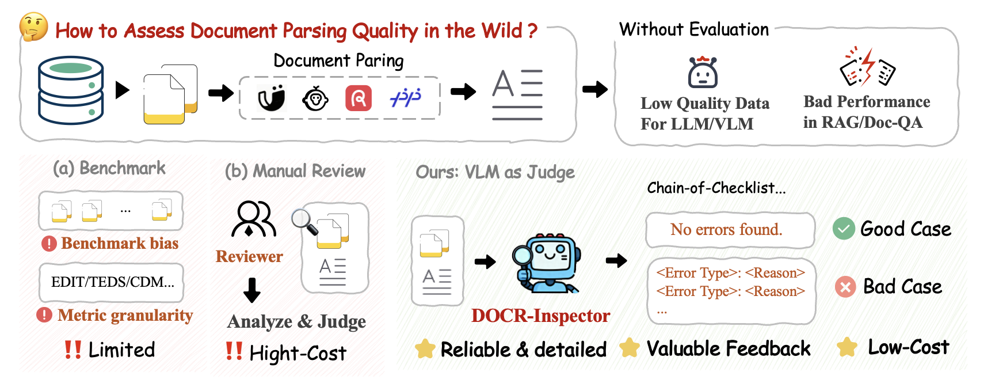
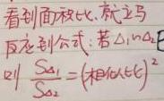
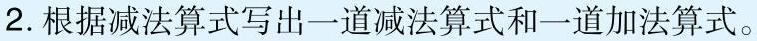
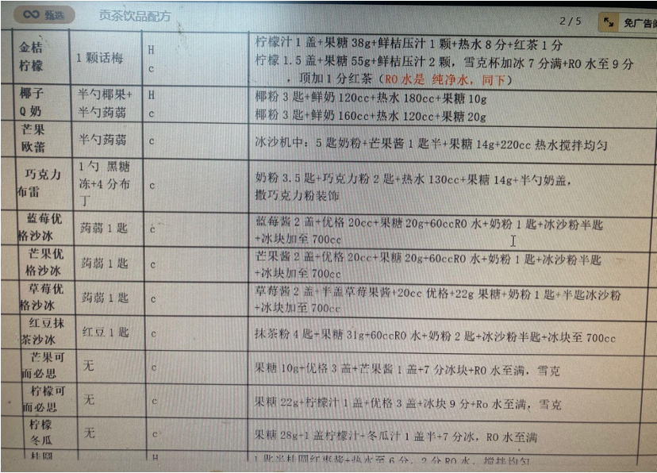
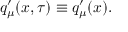
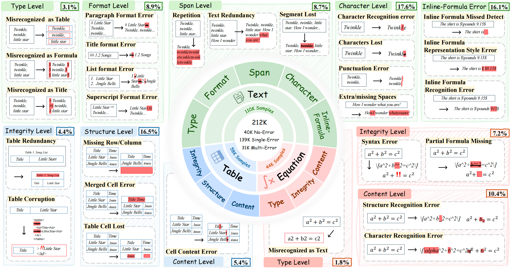

<h1 align="center">
DOCR-Inspector: Fine-Grained and Automated Evaluation of Document Parsing with VLM
</h1>

<p align="center">
<a href=""><b>📜 arXiv</b></a> |
<a href="https://huggingface.co/ZQTTTT/DOCR-Inspector-7B"><b>🤗 Huggingface Model</b></a> |
<a href="https://huggingface.co/datasets/ZQTTTT/DOCRcase-Datasets"><b>🤗 Huggingface Datasets</b></a>
</p>

**DOCR-Inspector** is a VLM-based evaluation framework designed to automatically assess document parsing results **without requiring ground-truth annotations**. 
This repository includes **DOCR-Inspector-7B**, a document parsing evaluation model fine-tuned from *Qwen2.5-VL-7B-Instruct*, along with inference & evaluation code demo.

<p align="center">
  <br>
</p>

# DOCR-Inspector

## 🔍 Introduction
DOCR-Inspector is a Vision-Language Model (VLM) designed for quality inspection of document parsing elements. It takes document element images and their corresponding parsing results as input, detects errors in the parsed content, categorizes them into 28 fine-grained error types, and delivers detailed quality assessment feedback.

## 🌟 Key Features

- **No Ground Truth Needed** — Evaluates parsing results directly, enabling scalable real-world document quality assessment.
- **28 Fine-grained Error Types** — Covers text, tables, formulas with multi-level error granularity.
- **Reliable Quality Judgement** — Equipped with *Chain-of-Checklist (CoCL)* reasoning, ensuring robust error discovery & explainable evaluation reports.

## 🧩 Examples 

<details>
<summary>Example 1 of Text Element</summary>

Image:
    <p align="center">
     <br>
    </p>
Output of a document parsing model:
```markdown
  看到面积比就立马反应到公式，若△1∽△2则 \\(\\frac{S_1}{S_2} = (相似比)^2\\)
```
Quality assessment from DOCR-Inspector-7B
```
  <think>
  ### Step 1: Element Category Recognition<category>text_with_inline_formula</category>
  ### Step 2: Quality Check based on Category
  ---
  **[Check the error list of Text]**
  1. Text Category Error Check
    Text misrecognized as formula: <reason>No such error was found.</reason> [No]
    Text misrecognized as table: <reason>No such error was found.</reason> [No]
    Text misrecognized as title: <reason>No such error was found.</reason> [No]
  2. Text Format level Error Check
    Text paragraph format error: <reason>No such error was found.</reason> [No]
    Title format recognition error: <reason>No such error was found.</reason> [No]
    List format recognition error: <reason>No such error was found.</reason> [No]
    Superscript citation format in text recognition error: <reason>No such error was found.</reason> [No]
  3. Paragraph-level Error Check
    Text repetition: <reason>No such error was found.</reason> [No]
    Text redundancy: <reason>No such error was found.</reason> [No]
    Text segment lost: <reason>No such error was found.</reason> [No]
  4. Text Detail Error Check
    Text characters lost: <reason>No such error was found.</reason> [No]
    Text punctuation recognition error: <reason>No such error was found.</reason> [No]
    Extra/missing spaces in text: <reason>No such error was found.</reason> [No]
    Text character recognition error: <reason>No such error was found.</reason> [No]
  5. Inline Formula (if applicable) Error Check
    Inline formula missed detection: <reason>No such error was found.</reason> [No]
    Inline formula representation style error: <reason>The OCR result uses plain text '△1∽△2' for the first formula while representing the second formula in LaTeX style '\\(\\frac{S_1}{S_2} = (相似比)^2\\)', leading to inconsistent inline formula styles. This inconsistency in representation confirms the presence of an Inline formula representation style error.</reason> [Yes]
    Inline formula recognition error: <reason>No such error was found.</reason> [No]
  </think>
  <answer>
  Bad Case: <error_type>Inline formula representation style error</error_type>
  </answer>
```
</details>


<details>
<summary>Example 2 of Text Element</summary>
  Image:
    <p align="center">
     <br>
    </p>
  Output of a document parsing model:
  ```markdown
    2.根据减法算式写出一道减法算式和一道加法算式
  ```
  Quality assessment from DOCR-Inspector-7B
  ```json
    <think>
    ### Step 1: Element Category Recognition<category>text</category>
    ### Step 2: Quality Check based on Category
    ---
    **[Check the error list of Text]**
    1. Text Category Error Check
    Text misrecognized as formula: <reason>No such error was found.</reason> [No]
    Text misrecognized as table: <reason>No such error was found.</reason> [No]
    Text misrecognized as title: <reason>No such error was found.</reason> [No]
    2. Text Format level Error Check
    Text paragraph format error: <reason>No such error was found.</reason> [No]
    Title format recognition error: <reason>No such error was found.</reason> [No]
    List format recognition error: <reason>No such error was found.</reason> [No]
    Superscript citation format in text recognition error: <reason>No such error was found.</reason> [No]
    3. Paragraph-level Error Check
    Text repetition: <reason>No such error was found.</reason> [No]
    Text redundancy: <reason>No such error was found.</reason> [No]
    Text segment lost: <reason>No such error was found.</reason> [No]
    4. Text Detail Error Check
    Text characters lost: <reason>No such error was found.</reason> [No]
    Text punctuation recognition error: <reason>The OCR result omits the full-width period '。' at the end of the sentence, leading to incorrect sentence segmentation. This omission causes the text to appear incomplete and alters the intended structure.</reason> [Yes]
    Extra/missing spaces in text: <reason>The image shows a space after the number '2.', but the OCR output omits this space, concatenating '2.' with the following text. Therefore, it is judged to contain an Extra/missing spaces in text error.</reason> [Yes]
    Text character recognition error: <reason>No such error was found.</reason> [No]
    </think>
    <answer>
    Bad Case: <error_type>Text punctuation recognition error</error_type><error_type>Extra/missing spaces in text</error_type>
    </answer>
  ```
</details>

<details>
<summary>Example of Table element</summary>
  Image:
    <p align="center">
     <br>
    </p>
  Output of a document parsing model:
    <table><tr><td></td><td>金桔
    柠檬</td><td>1颗话梅</td><td>H
    c</td><td>柠檬汁1盖+果糖38g+鲜桔压汁1颗+热水8分+红茶1分
    柠檬1.5盖+果糖55g+鲜桔压汁2颗，雪克杯加冰7分满+RO水至9分，顶加1分红茶（RO水是纯净水，同下）</td></tr><tr><td></td><td>椰子
    Q奶</td><td>半勺椰果+
    半勺荷藕</td><td>H
    c</td><td>椰粉3匙+鲜奶120cc+热水180cc+果糖10g
    椰粉3匙+鲜奶160cc+热水120cc+果糖20g</td></tr><tr><td></td><td>芒果
    欧蕾</td><td>半勺药房</td><td>c</td><td>冰沙机中：5匙奶粉+芒果酱1匙半+果糖14g+220cc热水搅拌均匀</td></tr><tr><td></td><td>巧克力
    布雷</td><td>1勺黑糖
    冻+4分布
    丁</td><td>c</td><td>奶粉3.5匙+巧克力粉2匙+热水130cc+果糖14g+半勺奶盖，
    撒巧克力粉装饰</td></tr><tr><td></td><td>蓝莓优
    格沙冰</td><td>药房1匙</td><td></td><td>蓝莓酱2盖+优格20cc+果糖20g+60ccRO水+奶粉1匙+冰沙粉半匙
    +冰块加至700cc</td></tr><tr><td></td><td>芒果优
    格沙冰</td><td>药房1匙</td><td>c</td><td>芒果酱2盖+优格20cc+果糖20g+60ccRO水+奶粉1匙+冰沙粉半匙
    +冰块加至700cc</td></tr><tr><td></td><td>草莓优
    格沙冰</td><td>药房1匙</td><td>c</td><td>草莓酱2盖+半盖草莓果酱+20cc优格+22g果糖+奶粉1匙+半匙冰沙粉
    +冰块加至700cc</td></tr><tr><td></td><td>红豆抹
    茶沙冰</td><td>红豆1匙</td><td>c</td><td>抹茶粉4匙+果糖31g+60ccRO水+奶粉2匙+冰沙粉半匙+冰块至700cc</td></tr><tr><td></td><td>芒果可
    而必思</td><td>无</td><td>c</td><td>果糖10g+优格3盖+芒果酱1盖+7分冰块+RO水至满，雪克</td></tr><tr><td></td><td>柠檬可
    而必思</td><td>无</td><td>c</td><td>果糖22g+柠檬汁1盖+优格3盖+冰块9分+Ro水至满，雪克</td></tr><tr><td></td><td>柠檬
    冬瓜</td><td>无</td><td>c</td><td>果糖28g-1盖柠檬汁-冬瓜汁1盖半+7分冰，RO水至满</td></tr><tr><td></td><td>桂圆</td><td></td><td>H</td><td>1. 费用料圆红烧蛋+热水至6分，2分RO水，搅拌均匀</td></tr></table>
  
  Quality assessment from DOCR-Inspector-7B
  ```
  <think>
    ### Step 1: Element Category Recognition<category>table</category>
    ### Step 2: Quality Check based on Category
    ---
    **[Check the error list of Table]**
    1. Table Category Error Check
    Table misrecognized as text: <reason>No such error was found.</reason> [No]
    2. Table Severe Error Check
    Text redundancy: <reason>No such error was found.</reason> [No]
    Table recognition corruption: <reason>No such error was found.</reason> [No]
    Partial table redundancy: <reason>The OCR result introduces an unnecessary first column with empty cells, which is not present in the original table, leading to a Partial table redundancy. This extra column disrupts the table's structure by adding irrelevant content.</reason> [Yes]
    3. Table Structure Error Check
    Missing table row/column: <reason>No such error was found.</reason> [No]
    Table merged cell error: <reason>No such error was found.</reason> [No]
    Table cell recognition lost: <reason>No such error was found.</reason> [No]
    4. Table Content Error Check
    Table cell content recognition error: <reason>No such error was found.</reason> [No]
    </think>
    <answer>
    Bad Case: <error_type>Partial table redundancy</error_type>
    </answer>
  ```
</details>

<details>
<summary> Example of Equation Element</summary>
  - Image:
    <p align="center">
     <br>
    </p>
  - Output of a document parsing model:
  ```markdown
    $a _ { \\mu } ^ { j } ( x , \\tau ) \\equiv q _ { \\mu } ^ { j } ( x ) .$
  ```
  - Quality assessment from DOCR-Inspector-7B
  ```
  <think>
  ### Step 1: Element Category Recognition<category>equation</category>
  ### Step 2: Quality Check based on Category
  ---
  **[Check the error list of Displayed Formula]**
  1. Formula Category Error Check:
  Displayed formula misrecognized as text: <reason>No such error was found.</reason> [No]
  2. Formula Severe Error Check
  Text redundancy: <reason>No such error was found.</reason> [No]
  Displayed formula syntax error: <reason>No such error was found.</reason> [No]
  Partial displayed formula missing: <reason>No such error was found.</reason> [No]
  3. Formula Detail Error Check
  Displayed formula structure recognition error: <reason>No such error was found.</reason> [No]
  Displayed formula character recognition error: <reason>The OCR result misrecognizes the variable 'q' as 'a' and the prime symbol '′' as a lowercase 'j', altering the original mathematical meaning. This misrecognition of individual characters within the formula constitutes a Displayed formula character recognition error.</reason> [Yes]
  </think>
  <answer>
  Bad Case: <error_type>Displayed formula character recognition error</error_type>
  </answer>
  ```
</details>

📁 Full definition available at: [assets/error_type_definition.json](./assets/error_type_definition.json)


# 📊 DOCRcase-200K & DOCRcasebench

## DOCRcase-200K
DOCRcase-200K is a large-scale dataset designed for fine-grained error detection and analysis. 
It contains 212K element-level parsing cases spanning 28 error types across text, table and equation elements; each error is paired with detailed reasoning annotations. 
<p align="center">
  <br>
</p>

## [DOCRcaseBench](https://huggingface.co/datasets/ZQTTTT/DOCRcase-Datasets)
DOCRcaseBench is a high-quality benchmark dataset tailored for evaluating document quality assessment models.
It comprises real parsed outputs from several state-of-the-art models, including MinerU2.0-pipeline, PP-StructureV3, GPT-4o, Qwen2.5-VL-7B-Instruct, MonkeyOCR-1.2B-Pro, and MinerU2.0-VLM. These models were selected as they represent strong, yet imperfect, performance across various benchmarks.
To ensure a balanced distribution of error types for robust evaluation, **we meticulously supplemented the dataset with additional, hand-crafted examples**.
**Every parsing result is annotated with human-verified error types.**

The overall composition of DOCRcaseBench by model source is detailed in the table below. 

| Model | Count | Percentage |
| :--- | :---: | :---: |
| MonkeyOCR-1.2B-Pro | 142 | 16.1% |
| PP-StructureV3 | 99 | 11.2% |
| MinerU2.0-pipeline | 149 | 16.9% |
| MinerU2.0-VLM | 22 | 2.5% |
| GPT-4o | 181 | 20.5% |
| Qwen2.5-VL-7B-Instruct | 105 | 11.9% |
| Experts (Hand-crafted/Supplemented) | 64 | 7.3% |
| **Total** | **882** | **100.0%** |

The distribution of document elements (cases) in DOCRcaseBench is summarized below:

| | Text | Table | Equation | **Total** |
| :--- | :---: | :---: | :---: | :---: |
| Good Case | 39 | 46 | 62 | 147 |
| Bad Case with Single Error | 339 | 141 | 81 | 561 |
| Bad Case with Multi Error | 70 | 55 | 49 | 174 |
| **Total** | **448** | **242** | **192** | **882** |


# 🔥 Performance
We present the evaluation results of various models on the DOCRcaseBench.

* **F1 of Case:** Measures the model's accuracy in the binary classification of output quality (Good/Bad).
* **Recall, Precision, and F1 of Error Type:** Quantify the model's performance in detecting and correctly classifying the specific error types within the document parsing results.

**DOCR-Inspector-7B achieves state-of-the-art results across all element types.**

<table>
    <thead>
        <tr>
            <th rowspan="3">Model</th>
            <th colspan="4">Text</th>
            <th colspan="4">Table</th>
            <th colspan="4">Equation</th>
        </tr>
        <tr>
            <th colspan="2">Case</th>
            <th colspan="2">Error Type</th>
            <th colspan="2">Case</th>
            <th colspan="2">Error Type</th>
            <th colspan="2">Case</th>
            <th colspan="2">Error Type</th>
        </tr>
        <tr>
            <th>F1</th>
            <th>Recall</th>
            <th>F1</th>
            <th>Precision</th>
            <th>F1</th>
            <th>Recall</th>
            <th>F1</th>
            <th>Precision</th>
            <th>F1</th>
            <th>Recall</th>
            <th>F1</th>
            <th>Precision</th>
        </tr>
    </thead>
    <tbody>
        <tr>
            <th colspan="13">Proprietary Non-Reasoning Models</th>
        </tr>
        <tr>
            <td>GPT-4o w/o CoT</td>
            <td>72.05</td><td>31.66</td><td>28.8</td><td>28.04</td>
            <td>73.69</td><td>29.89</td><td>26.36</td><td>25.03</td>
            <td>79.2</td><td>49.31</td><td>47.2</td><td>46.31</td>
        </tr>
        <tr>
            <td>GPT-4o w/ CoT</td>
            <td>77.69</td><td>30.54</td><td>27.25</td><td>26.35</td>
            <td>81.23</td><td>34.23</td><td>29.64</td><td>28.17</td>
            <td>79.38</td><td>46.44</td><td>45.45</td><td>45.4</td>
        </tr>
        <tr>
            <td>Gemini 2.5 Flash w/o CoT</td>
            <td>84.89</td><td>43.29</td><td>29.88</td><td>25.43</td>
            <td>82.21</td><td>41.94</td><td>25.97</td><td>21.29</td>
            <td>80.46</td><td>53.73</td><td>48.17</td><td>45.96</td>
        </tr>
        <tr>
            <td>Gemini 2.5 Flash w/ CoT</td>
            <td>84.75</td><td>42.24</td><td>29.74</td><td>25.69</td>
            <td>81.16</td><td>42.36</td><td>24.1</td><td>19.25</td>
            <td><ins>80.94</ins></td><td>50.61</td><td>46.17</td><td>44.63</td>
        </tr>
        <tr>
            <th colspan="13">Open-source Non-Reasoning Models</th>
        </tr>
        <tr>
            <td>Qwen2.5-VL-7B-Instruct w/o CoT</td>
            <td>46.15</td><td>12.28</td><td>11.98</td><td>11.83</td>
            <td>48.8</td><td>19.42</td><td>19.42</td><td>19.42</td>
            <td>55.8</td><td>32.81</td><td>32.81</td><td>32.81</td>
        </tr>
        <tr>
            <td>Qwen2.5-VL-7B-Instruct w/ CoT</td>
            <td>38.17</td><td>12.05</td><td>11.64</td><td>11.5</td>
            <td>43.48</td><td>21.56</td><td>21.72</td><td>22.11</td>
            <td>68.1</td><td>32.29</td><td>32.12</td><td>32.03</td>
        </tr>
        <tr>
            <td>Qwen2.5-VL-72B-Instruct w/o CoT</td>
            <td>82.68</td><td>28.49</td><td>24.74</td><td>23.43</td>
            <td>83.51</td><td>40.91</td><td>33.94</td><td>31.03</td>
            <td>78.51</td><td>39.93</td><td>37.19</td><td>35.76</td>
        </tr>
        <tr>
            <td>Qwen2.5-VL-72B-Instruct w/ CoT</td>
            <td>74.55</td><td>30.97</td><td>26.23</td><td>24.56</td>
            <td>76.82</td><td>40.7</td><td>31.77</td><td>28.43</td>
            <td>79.14</td><td>44.53</td><td>41.23</td><td>39.79</td>
        </tr>
        <tr>
            <th colspan="13">Reasoning Models</th>
        </tr>
        <tr>
            <td>Qwen3-VL-235B-A22B-Thinking</td>
            <td>83.9</td><td>42.02</td><td>31.19</td><td>27.46</td>
            <td>83.13</td><td>39.12</td><td>28.57</td><td>25.49</td>
            <td>78.56</td><td>40.8</td><td>38.45</td><td>37.76</td>
        </tr>
        <tr>
            <td>Gemini 2.5 Pro Thinking</td>
            <td>88.46</td><td>47.17</td><td>32.9</td><td>28.16</td>
            <td>82.01</td><td><ins>43.60</ins></td><td>32.93</td><td>29.63</td>
            <td>77.19</td><td>53.04</td><td>48.58</td><td><ins>47.27</ins></td>
        </tr>
        <tr>
            <th colspan="13">Ours:</th>
        </tr>
        <tr class="ours-row">
            <td><strong>DOCR-Inspector-7B</strong></td>
            <td><strong>96.43</strong></td><td><strong>81.06</strong></td><td><strong>80.21</strong></td><td><strong>81.03</strong></td>
            <td><strong>86.41</strong></td><td><strong>63.09</strong></td><td><strong>62.11</strong></td><td><strong>62.95</strong></td>
            <td><strong>85.42</strong></td><td><strong>74.39</strong></td><td><strong>73.81</strong></td><td><strong>74.48</strong></td>
        </tr>
    </tbody>
</table>

# 🛠️ Usage

## Installation

DOCR-Inspector-7B is trained based on Qwen2.5-VL-7B-Instruct, so you can follow the [Qwen2.5-VL-7B-Instruct installation guide](https://github.com/QwenLM/Qwen3-VL?tab=readme-ov-file#quickstart). 

We highly recommend installing [`vLLM >= 0.7.2`](https://github.com/vllm-project/vllm) to improve inference speed.

## Inference with vLLM

Prepare your element-cropped image and the corresponding parsing results. The required data format should conform to the structure found in `./DOCR-Inspector/demo_data`.

Then, run the following command to perform inference:
```bash
python run_case_inf_vllm.py --model_path ZQTTTT/DOCR-Inspector-7B --image_path /path/to/image --ocr_path /path/to/parsing_result
```

## Evaluation

Download DOCRcase- dataset from [DOCRcaseBench](https://huggingface.co/datasets/ZQTTTT/DOCRcase-Datasets).
We provide a complete evaluation pipeline that supports inference using **DOCR-Inspector**, **API models**, and **vLLM**.

| Component | Description | Path |
|---|---|---|
| vLLM Inference Scripts | Run DOCR-Inspector locally | [`bench_inf_DOCR-Inspector.py`](./evaluation/inf/bench_inf_DOCR-Inspector.py) |
| vLLM Inference Scripts | Run other VLM locally | [`bench_inf_qwenvl_vllm.py`](./evaluation/inf/bench_inf_qwenvl_vllm.py) |
| API Evaluation Scripts | Evaluate GPT/Gemini etc. | [`bench_inf_api.py`](./evaluation/inf/bench_inf_api.py) |
| Pre-computed Paper Results | Results used in the main paper | [`evaluation/results`](./evaluation/results/) |
| Metric Computation Notebook | Compute F1/Precision/Recall | [`metrics.ipynb`](./evaluation/metrics/metrics.ipynb) |


## 📌 ToDo Lists
- [x] Release Inference and Evaluation Code
- [x] Release ✨ DOCR-Inspector-7B Checkpoints
- [x] Release ✨ DOCRcaseBench
- [ ] Release ✨ DOCRcase-200K

## Acknowledgements
- [Qwen2.5-VL](https://huggingface.co/collections/Qwen/qwen25-vl)
- [Omnidocbench](https://github.com/opendatalab/OmniDocBench)

# Citation

```

```

# License
DOCR-Inspector is released under `CC BY-NC-SA 4.0` license. By downloading our dataset from our website or other sources, the user agrees to adhere to the terms of `CC BY-NC-SA 4.0` and licenses of the source datasets